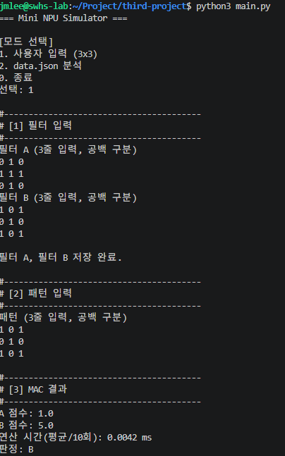

# Mini NPU 시뮬레이터

AI의 MAC(Multiply-Accumulate) 연산 원리를 흉내 내어, 십자가(Cross)/X 패턴을 필터와 비교·판정하는 콘솔 애플리케이션이다. 명세는 `docs/reference.md`, 세부 구현 체크리스트는 `docs/TODO.md`를 따른다.

## 0. 요구사항 충족 현황

이 README는 <code>docs/reference.md</code>를 기준으로 작성했다. 아래 표는 평가자가 필수 요구사항과 문서 근거를 빠르게 대조할 수 있도록 만든 추적표다. 성능 시간과 스크린샷처럼 실행 환경에 따라 달라지는 값은 같은 실행 결과의 로그·리포트와 함께 갱신해야 한다.

| 필수 요구사항 | README 근거 | 문서화한 충족 기준 |
|---|---|---|
| Python 3.8 이상, 외부 라이브러리 금지 | 1. 실행 방법, 2. 구현 요약 | 표준 라이브러리만 사용하고 Python 3.8 호환 문법으로 실행한다. |
| 모드 1: 3×3 A/B 필터와 패턴 | 1. 실행 방법, 3. 실행 흐름, 6. 재현성 | 행당 숫자 3개를 받아 점수·시간·A/B/판정 불가를 출력한다. |
| 모드 1 입력 오류 재입력 | 1. 실행 방법, 6. 재현성 | 행·열 수 또는 숫자 파싱 오류는 안내 후 행렬 전체를 다시 입력받는다. |
| 모드 2: <code>data.json</code> 분석 | 2-1. data.json 계약과 실패 격리, 4. 콘솔 로그 | <code>size_N</code> 키에서 N을 읽어 해당 필터를 선택하고 case별 결과를 남긴다. |
| 라벨 정규화 | 2. 구현 요약, 2-1. data.json 계약 | <code>+</code>/<code>cross</code>는 Cross, <code>x</code>는 X로 표준화해 출력과 비교에 사용한다. |
| 반복문 기반 MAC | 2. 구현 요약 | 외부 벡터화 라이브러리 없이 위치별 곱셈과 누적 덧셈을 수행한다. |
| epsilon 기반 판정 | 2. 구현 요약, 5. 결과 리포트 | <code>abs(score_a - score_b) &lt; 1e-9</code>일 때만 UNDECIDED다. |
| 성능 분석 | 5. 결과 리포트, 6. 재현성 | I/O를 제외한 MAC 구간을 최소 10회 반복하고 크기·평균 ms·N²를 함께 기록한다. |
| 결과 요약과 실패 분석 | 4. 콘솔 로그, 5. 결과 리포트 | Total/PASS/FAIL, 실패 case ID·사유, 데이터·수치·로직 원인 분리를 제공한다. |
| README 리포트와 O(N²) 근거 | 5. 결과 리포트 | 측정값과 연산 횟수를 연결한 10줄 이상 분석을 제공한다. |
| 재현성과 자동 검증 | 6. 재현성, 7. 자동 검증 | 정상·동점·오류 사례와 테스트 실행 명령을 제공한다. |
| 선택 보너스 | 2. 구현 요약, 5. 결과 리포트 | 패턴 생성기와 2D/1D 평탄화 비교를 필수 기능과 분리해 기록한다. |

> 이 표는 README 문서의 요구사항 충족 범위를 나타낸다. 현재 구현의 실행 결과가 바뀌면 수치, case 결과, 스크린샷도 함께 갱신한다.

## 📷 실행 스크린샷 (Execution Screenshots)

현재 저장소에는 모드 1 기준 입력을 실제로 실행해 캡처한 이미지가 있다. 이 캡처의 점수와 판정은 아래의 모드 1 기준 로그와 같으며, 측정 시간은 캡처 시점의 값(`0.0042 ms`)이다. 시간은 실행 시점마다 달라질 수 있으므로, 모드 2용 이미지는 아래 로그를 캡처한 **같은 실행 결과**로 추가한다.

| 모드 1: 사용자 입력 (3×3) | 모드 2: data.json 일괄 분석 및 성능 표 |
|:---:|:---:|
|  | 실제 캡처를 `docs/screenshots/mode2_execution.png`에 저장한 뒤 아래 마크다운을 사용 |

모드 2의 실제 스크린샷 파일은 현재 저장소에 없으므로 존재하지 않는 이미지를 링크하지 않았다. 다음 경로와 파일명을 사용해 캡처를 저장한다.

- 저장 경로: `docs/screenshots/`
- 권장 파일명: `mode1_execution.png`, `mode2_execution.png`
- 모드 2 첨부용 마크다운: ``
- 캡처 직전에 새로 실행했다면, 이미지의 평균 시간(ms)·연산 횟수·통과/실패 수가 아래 **실제 콘솔 실행 로그** 및 **결과 리포트**의 값과 같도록 함께 갱신한다.


## 1. 실행 방법

```bash
python3 main.py
```

- Python 3.8 이상이 필요하다 (`main.py` 최상단에서 버전을 확인하고, 미달 시 안내 후 종료한다). 표준 라이브러리(`json`, `time`, `math`, `re`, `typing`, `os`, `sys`)만 사용하며 외부 라이브러리는 사용하지 않는다.
- 이 작업공간에는 `python` 명령이 없으므로 `python3 main.py`를 사용한다. 다른 환경에서 `python`이 Python 3을 가리킨다면 `python main.py`도 동등하다.
- 실행 후 메뉴에서 `1`(사용자 입력, 3×3) 또는 `2`(data.json 분석)를 선택한다. `0`을 입력하면 종료한다.
- **모드 1**: 필터 A, 필터 B, 패턴을 각각 3줄(공백으로 구분된 숫자 3개)씩 입력한다. 형식이 잘못되면 오류 안내 후 해당 행렬 전체를 다시 입력받는다.
- **모드 2**: `main.py`와 같은 디렉터리에 있는 `data.json`을 읽어 일괄 분석한다. (경로는 실행 위치가 아니라 `main.py` 파일 기준으로 고정한다.)
- 제출 파일은 `main.py`, `README.md`이며, `data.json`은 모드 2 분석용 샘플 입력 데이터로 함께 포함했다(형식은 명세를 따라 임의로 구성한 예시 데이터).

## 2. 구현 요약

- **데이터 구조**: 패턴/필터는 `List[List[float]]` 형태의 2차원 리스트로 저장하고 `grid[row][col]`로 접근한다. `validate_grid()`가 정방 행렬 여부, 숫자 타입(불리언 제외), NaN/무한대 여부, 기대 크기 일치 여부를 모두 검증한 뒤 float로 정규화한 행렬을 반환한다. 크기별 하드코딩 없이 3×3부터 25×25까지 동일한 함수로 처리한다.
- **MAC 연산**: `mac(pattern, filter)`은 이중 `for` 반복문으로 `pattern[r][c] * filter[r][c]`를 누적 합산한다. NumPy 등 벡터화 라이브러리를 사용하지 않으며, 크기가 다르면 `zip`으로 조용히 잘라내지 않고 `ValueError`를 발생시킨다.
- **라벨 정규화**: `normalize_label()`이 원본 라벨을 아래 표대로 표준화한다(공백 제거, 대소문자 무시). 알 수 없는 라벨은 `None`을 반환해 해당 케이스를 FAIL(`EXPECTED_LABEL_INVALID`/필터 로드 실패)로 처리하도록 한다. 콘솔 출력과 PASS/FAIL 비교는 항상 이 표준 라벨만 사용하며, 원본 문자열(`+`, `x` 등)로는 비교하지 않는다.

  | 등장 위치 | 원본 값(예시) | 표준 라벨 |
  |---|---|---|
  | `patterns.*.expected` | `+` | `Cross` |
  | `filters.size_N`의 필터 키 | `cross`, `Cross` | `Cross` |
  | `patterns.*.expected` | `x` | `X` |
  | `filters.size_N`의 필터 키 | `x`, `X` | `X` |
  | 위 목록에 없는 값 | 예: `triangle`, `null` | 없음 → 해당 케이스 FAIL |
- **동점 처리(epsilon)**: `judge_scores()`는 `abs(score_a - score_b) < 1e-9`이면 `"UNDECIDED"`를 반환하고, 그렇지 않으면 더 큰 점수의 라벨을 반환한다. `==` 비교는 사용하지 않으며, 차이가 epsilon과 정확히 같은 경계값은 동점으로 보지 않는다(엄격한 `<` 비교). 모드 1은 A/B/판정 불가, 모드 2는 Cross/X/UNDECIDED로 출력만 다르게 한다.
- **모드 2 스키마 검증**: `data.json`의 `filters.size_N`, `patterns.size_{N}_{idx}` 구조를 읽고, 케이스별로 `INVALID_CASE_KEY`, `FILTER_NOT_FOUND`, `SIZE_MISMATCH`, `EXPECTED_LABEL_INVALID`, `UNDECIDED`, `PREDICTION_MISMATCH` 등 사유 코드를 남겨 개별 FAIL 처리한다. 한 케이스의 오류가 다른 케이스 처리를 중단시키지 않으며, 파일이 없거나 JSON 파싱에 실패해도 프로그램은 종료되지 않고 메뉴로 복귀한다.
- **성능 측정**: `measure_mac_time()`은 `mac()` 호출 구간만 `time.perf_counter()`로 감싸 10회 반복 평균을 ms 단위로 계산한다. 파일 읽기, 입력, 출력 시간은 측정 구간에서 제외했다.
- **보너스 1 (패턴 생성기)**: `generate_cross_pattern(n)`, `generate_x_pattern(n)`이 임의 크기 N에 대해 Cross/X 패턴을 생성한다(짝수 N은 중심을 `n // 2` 행/열, X는 두 대각선 기준으로 정의). `data.json`에 없는 3×3 성능 표본과, 필터 로드에 실패한 크기의 대체 표본으로 재사용한다.
- **보너스 2 (메모리 접근 최적화)**: `flatten()`으로 2차원 리스트를 길이 N²의 1차원 리스트로 변환하고, `mac_flat()`이 `flat[i]` 접근 방식으로 동일한 MAC 연산을 수행한다. `build_flatten_comparison_rows()`로 2D/1D 버전을 동일 입력·동일 반복 횟수로 비교했다(결과는 아래 5절 참고).

## 2-1. data.json 계약과 실패 격리

모드 2는 파일을 단순히 읽는 기능이 아니라, 키 규칙과 Grid 크기를 검증한 뒤 독립적인 case 결과를 만드는 배치 분석 기능이다. 최소 구조는 다음과 같다.

~~~json
{
  "filters": {
    "size_5": {
      "cross": [[... 5 values ...], "..."],
      "x": [[... 5 values ...], "..."]
    }
  },
  "patterns": {
    "size_5_1": {
      "input": [[... 5 values ...], "..."],
      "expected": "x"
    }
  }
}
~~~

위 코드는 구조를 보여 주는 축약 예시다. 실제 <code>size_5</code> 아래 Grid는 모두 5×5여야 하며, <code>size_13</code>과 <code>size_25</code>도 같은 규칙을 따른다.

| 단계 | 확인 내용 | 성공 시 | 실패 시 |
|---|---|---|---|
| size 키 해석 | <code>filters.size_N</code>, <code>patterns.size_N_idx</code> 형식과 N 추출 | 해당 N의 필터 묶음을 선택한다. | <code>INVALID_CASE_KEY</code> 또는 <code>FILTER_NOT_FOUND</code>로 해당 case만 FAIL 처리한다. |
| 레이블 정규화 | filter 키와 <code>expected</code>를 Cross/X로 변환 | 표준 라벨로 점수·PASS/FAIL을 비교한다. | 알 수 없는 라벨 또는 정규화 뒤 중복은 스키마 오류로 남긴다. |
| Grid 검증 | 2D 구조, 정방 n×n, 유한 숫자, 기대 N | 검증된 float Grid를 MAC에 전달한다. | <code>PATTERN_GRID_INVALID</code> 또는 <code>SIZE_MISMATCH</code>로 MAC을 건너뛴다. |
| 점수와 판정 | Cross/X 각각 MAC, epsilon 비교 | Cross, X 또는 UNDECIDED를 만든다. | UNDECIDED는 유효한 판정 결과이지만 expected가 Cross/X이면 FAIL이다. |
| 집계 | case 결과 하나당 상태 하나 | PASS 또는 FAIL을 1회 기록한다. | 오류가 있어도 다음 case를 계속 처리하며 <code>Total = PASS + FAIL</code>을 유지한다. |

크기가 다른 패턴과 필터를 <code>zip()</code>으로 조용히 잘라 계산하면 안 된다. 올바른 흐름은 <strong>키 해석 → 정규화 → Grid 검증 → MAC → epsilon 판정 → expected 비교 → case 집계</strong>다.

### 제출 전 요구사항 점검

- [x] Python 3.8 이상, 표준 라이브러리만 사용, 실행 명령과 메뉴를 설명했다.
- [x] 모드 1의 3×3 입력, 재입력 정책, 점수·시간·판정을 설명했다.
- [x] 모드 2의 <code>size_5/13/25</code>, <code>size_N_idx</code>, case 단위 FAIL 지속 처리를 설명했다.
- [x] Cross/X 정규화, 반복문 MAC, 엄격한 <code>abs(diff) &lt; 1e-9</code> 정책을 설명했다.
- [x] 최소 10회 평균, ms, N², I/O 제외 측정 범위를 설명했다.
- [x] case별 점수·판정·expected·상태와 전체 PASS/FAIL·실패 원인·O(N²) 리포트를 제공했다.
- [x] 정상·동점·오류 재현 방법과 자동 테스트 명령을 제공했다.
- [x] 1D 평탄화와 패턴 생성기는 선택 보너스이며, 동일 입력·동일 반복 조건의 별도 비교로 설명했다.

성능 표의 <code>N²</code>는 패턴 하나와 필터 하나 사이의 MAC 1회 기준이다. Cross/X 두 필터를 모두 채점하는 전체 비교 비용은 <code>2N²</code>이지만, 상수항을 제외한 시간 복잡도는 여전히 <code>O(N²)</code>다.

## 3. 실행 흐름

- **모드 1**: 필터 A 입력 → 필터 B 입력 → 저장 완료 확인 → 패턴 입력 → MAC 연산 → A/B 점수·판정 출력 → 3×3 평균 연산 시간(ms) 출력.
- **모드 2**: 필터 로드(size_5/13/25) → 패턴별 검증·MAC·판정·PASS/FAIL 출력(라벨 정규화 적용) → 성능 표(3×3, 5×5, 13×13, 25×25) → 결과 요약(총/통과/실패, 실패 케이스 목록).

## 4. 🖥️ 실제 콘솔 실행 로그 (Console Execution Logs)

아래는 `python3 -B main.py`로 확인한 실제 콘솔 출력이다. 코드 블록의 행렬 값은 터미널에서 입력한 값까지 포함한다. 평균 시간은 `time.perf_counter()` 기반의 10회 평균이므로, 점수·판정·건수와 달리 재실행 시 마지막 소수 자리가 달라질 수 있다.

### 모드 1: 사용자 입력 3×3 — 십자가 필터 A, X 필터 B, X 패턴

`docs/screenshots/image1.png`의 기준 실행과 같은 입력·점수·판정 로그이다.

```text
=== Mini NPU Simulator ===

[모드 선택]
1. 사용자 입력 (3x3)
2. data.json 분석
0. 종료
선택: 1

#----------------------------------------
# [1] 필터 입력
#----------------------------------------
필터 A (3줄 입력, 공백 구분)
0 1 0
1 1 1
0 1 0
필터 B (3줄 입력, 공백 구분)
1 0 1
0 1 0
1 0 1

필터 A, 필터 B 저장 완료.

#----------------------------------------
# [2] 패턴 입력
#----------------------------------------
패턴 (3줄 입력, 공백 구분)
1 0 1
0 1 0
1 0 1

#----------------------------------------
# [3] MAC 결과
#----------------------------------------
A 점수: 1.0
B 점수: 5.0
연산 시간(평균/10회): 0.0042 ms
판정: B
```

### 모드 1: epsilon 동점 입력

필터 A는 십자가, 필터 B는 X이고 중앙 값만 1인 패턴을 입력했다. 두 필터의 점수가 모두 1.0이므로 `|A-B| < 1e-9` 규칙이 적용된다.

```text
=== Mini NPU Simulator ===

[모드 선택]
1. 사용자 입력 (3x3)
2. data.json 분석
0. 종료
선택: 1

#----------------------------------------
# [1] 필터 입력
#----------------------------------------
필터 A (3줄 입력, 공백 구분)
0 1 0
1 1 1
0 1 0
필터 B (3줄 입력, 공백 구분)
1 0 1
0 1 0
1 0 1

필터 A, 필터 B 저장 완료.

#----------------------------------------
# [2] 패턴 입력
#----------------------------------------
패턴 (3줄 입력, 공백 구분)
0 0 0
0 1 0
0 0 0

#----------------------------------------
# [3] MAC 결과
#----------------------------------------
A 점수: 1.0
B 점수: 1.0
연산 시간(평균/10회): 0.0011 ms
판정: 판정 불가 (|A-B| < 1e-09, epsilon 동점 규칙)
```

### 모드 2: `data.json` 일괄 분석 및 성능 분석

```text
=== Mini NPU Simulator ===

[모드 선택]
1. 사용자 입력 (3x3)
2. data.json 분석
0. 종료
선택: 2

#----------------------------------------
# [1] 필터 로드
#----------------------------------------
✓ size_5 필터 로드 완료 (Cross, X)
✓ size_13 필터 로드 완료 (Cross, X)
✓ size_25 필터 로드 완료 (Cross, X)

#----------------------------------------
# [2] 패턴 분석 (라벨 정규화 적용)
#----------------------------------------
--- size_5_1 ---
Cross 점수: 1.0
X 점수: 9.0
판정: X | expected: X | PASS
--- size_5_2 ---
Cross 점수: 9.0
X 점수: 1.0
판정: Cross | expected: Cross | PASS
--- size_13_1 ---
Cross 점수: 0.0
X 점수: 0.0
판정: UNDECIDED | expected: X | FAIL
  사유: 동점(|Cross-X| < 1e-09) 규칙에 따라 FAIL
--- size_13_2 ---
Cross 점수: 25.0
X 점수: 1.0
판정: Cross | expected: Cross | PASS
--- size_13_3 ---
판정 불가(스키마 오류): 키에서 읽은 크기 13와 패턴 행렬 크기 10가 다릅니다. [SIZE_MISMATCH]
--- size_25_1 ---
Cross 점수: 1.0
X 점수: 49.0
판정: X | expected: X | PASS
--- size_25_2 ---
Cross 점수: 49.0
X 점수: 1.0
판정: Cross | expected: Cross | PASS

#----------------------------------------
# [3] 성능 분석 (평균/10회)
#----------------------------------------
크기                 평균 시간(ms)         연산 횟수
------------------------------------------
3×3                   0.0011             9
5×5                   0.0019            25
13×13                 0.0077           169
25×25                 0.0246           625

#----------------------------------------
# [4] 결과 요약
#----------------------------------------
총 테스트: 7개
통과: 5개
실패: 2개

실패 케이스:
- size_13_1: 동점(|Cross-X| < 1e-09) 규칙에 따라 FAIL
- size_13_3: 키에서 읽은 크기 13와 패턴 행렬 크기 10가 다릅니다.
```

## 5. 결과 리포트

아래 분석은 바로 위 모드 2 실제 로그를 기준으로 한다(환경: Python 3.12.3, Linux, `PERF_REPEAT=10`). 따라서 케이스별 점수, PASS/FAIL 수, 실패 사유, 성능 표의 평균 시간과 N²가 로그와 일치한다. 시간은 CPU 부하·타이머 해상도에 따라 달라질 수 있으므로, 새 캡처로 교체할 때는 로그·스크린샷·이 절의 성능 수치를 한 실행 결과로 함께 갱신한다.

**케이스 결과 총계**
- 총 테스트 7개 중 통과 5개, 실패 2개였다. 실패는 성격이 다른 두 가지 원인으로 발생해 아래에서 구분해 분석한다.

**실제 로그와 일치하는 케이스별 결과**

| 케이스 | Cross 점수 | X 점수 | 판정 | expected | 결과 |
|---|---:|---:|---|---|---|
| `size_5_1` | 1.0 | 9.0 | X | X | PASS |
| `size_5_2` | 9.0 | 1.0 | Cross | Cross | PASS |
| `size_13_1` | 0.0 | 0.0 | UNDECIDED | X | FAIL |
| `size_13_2` | 25.0 | 1.0 | Cross | Cross | PASS |
| `size_13_3` | — | — | SIZE_MISMATCH | X | FAIL |
| `size_25_1` | 1.0 | 49.0 | X | X | PASS |
| `size_25_2` | 49.0 | 1.0 | Cross | Cross | PASS |

**실패 1 — `size_13_1` (수치 비교/동점 문제)**
- 입력 패턴을 의도적으로 모두 0으로 채워 Cross 점수와 X 점수가 둘 다 정확히 `0.0`이 되도록 구성했다.
- `abs(0.0 - 0.0) = 0.0 < 1e-9`이므로 `judge_scores()`가 `UNDECIDED`를 반환했다.
- 명세상 UNDECIDED는 expected가 Cross 또는 X인 이상 PASS가 될 수 없어 FAIL로 집계된다.
- 이는 로직 결함이 아니라 epsilon 동점 정책이 설계대로 동작한 결과다.

**실패 2 — `size_13_3` (데이터/스키마 문제)**
- 패턴 키는 `size_13_3`이지만 `input`을 의도적으로 10×10 행렬로 구성해 키에서 읽은 크기(13)와 실제 행렬 크기(10)를 불일치시켰다.
- `analyze_case()`는 이를 `SIZE_MISMATCH`로 즉시 FAIL 처리하고 MAC 연산 자체를 시도하지 않는다.
- 이 케이스의 실패가 이후 `size_25_1`, `size_25_2` 케이스 처리를 막지 않는다는 것도 실행 결과로 확인했다.
- 로직 문제(판정 알고리즘 오류)로 인한 FAIL은 발생하지 않았다. 라벨 정규화(`+`/`cross`→Cross, `x`→X)와 MAC 계산은 모든 정상 케이스에서 expected와 일치했다.

**로직 문제(판정 알고리즘 오류) — 해당 없음**
- 명세가 요구하는 세 번째 FAIL 범주인 "로직 문제"는 이번 실행에서 발생하지 않았다. 근거는 다음과 같다.
- `size_5_1`(expected `x`), `size_5_2`(expected `+`), `size_13_2`(expected `cross`), `size_25_1`(expected `x`), `size_25_2`(expected `+`) 5개 케이스 모두 `judge_scores()`의 판정이 정규화된 expected와 정확히 일치해 PASS로 집계됐다.
- 즉 `mac()`의 곱셈-누적 계산, `normalize_label()`의 라벨 매핑, `judge_scores()`의 대소 비교 중 어느 하나라도 구현이 잘못됐다면 이 5개 중 최소 하나는 `PREDICTION_MISMATCH`로 FAIL이 됐을 것이다. 그런 케이스가 없다는 것이 로직이 설계대로 동작한다는 근거다.
- (참고) 만약 실행 결과가 FAIL 0건이었다면, PASS로 이어진 이유는 위와 동일하게 라벨 정규화·MAC 계산·epsilon 동점 정책이 모든 케이스에서 일관되게 올바른 판정을 냈기 때문이라고 설명하면 된다. 이번 실행은 FAIL이 2건(수치 비교 1건, 데이터/스키마 1건) 존재하므로 이 항목은 참고용이다.

**성능 표 해석과 O(N²) 근거**
- 위 실제 실행의 평균 시간(10회 반복)은 3×3 0.0011ms(9회 연산), 5×5 0.0019ms(25회 연산), 13×13 0.0077ms(169회 연산), 25×25 0.0246ms(625회 연산)이었다.
- MAC 한 번은 N×N의 모든 위치를 정확히 한 번씩 방문해 곱하고 더하므로 연산 횟수는 N²이고, 시간복잡도는 O(N²)이다.
- 이 관계는 큰 N에서 뚜렷하다. 13×13→25×25 구간은 연산 횟수가 3.7배(169→625) 늘었고 측정 시간도 약 3.2배(0.0077→0.0246ms) 늘어 이론값에 가깝다.
- 반면 3×3→5×5 구간은 연산 횟수가 2.8배 늘었지만 시간은 약 1.7배만 늘었는데, 작은 N에서는 실제 곱셈·덧셈보다 함수 호출/반복문 진입 같은 인터프리터 고정 오버헤드가 측정값에서 차지하는 비중이 커서 순수 O(N²) 곡선과 정확히 비례하지 않기 때문이다.
- 즉 측정값이 항상 단조 비례하는지가 아니라, N이 커질수록 연산 횟수 증가율과 시간 증가율이 수렴한다는 점이 O(N²) 경향의 근거다.
- 위 표의 N²와 시간은 패턴 하나를 필터 하나와 MAC 1회 비교한 기준이다. 실제 판정에서는 Cross/X 두 필터 모두와 비교하므로, 패턴 하나를 분류하는 전체 비용은 MAC 2회, 즉 2N²이다(예: 25×25는 625가 아니라 1,250회 곱셈-누적).

**보너스: 2D vs 1D(flatten) 메모리 접근 비교** (동일 입력, 반복 30회)
- 이 비교는 위 모드 2 성능 표(반복 10회)와 별도의 측정 경로이므로, 다른 실행에서 얻은 고정 ms 값을 이 문서의 실제 모드 2 로그와 섞어 쓰지 않는다. `build_flatten_comparison_rows(repeat=30)`로 같은 입력과 반복 횟수에서 2D/1D 시간을 측정해 비교한다.
- 1차원 배열은 중첩 리스트의 이중 인덱싱(`grid[r][c]`, 리스트 참조를 두 번 따라가는 것) 대신 단일 인덱싱(`flat[i]`)만 사용하므로 작은 N에서는 그 오버헤드 절감분이 상대적으로 크게 보인다.
- N이 커질수록 총 연산 횟수(N²) 자체가 지배적인 비용이 되어 인덱싱 방식의 차이는 상대적으로 희석된다. 비교 표를 새로 첨부할 때도 해당 실행의 전체 행을 함께 기록해야 한다.

## 6. 재현성

- Python 3.12.3, Linux 환경에서 측정했다(요구사항인 3.8 이상 호환 문법만 사용).
- `PERF_REPEAT = 10` (성능 표), 보너스 비교표는 `repeat=30`으로 별도 측정했다.
- 모드 1 재현: 필터 A에 십자가(`0 1 0 / 1 1 1 / 0 1 0`), 필터 B에 X(`1 0 1 / 0 1 0 / 1 0 1`), 패턴에 X(`1 0 1 / 0 1 0 / 1 0 1`)를 입력하면 A=1.0, B=5.0, 판정=B가 출력된다. 연결된 기준 스크린샷의 시간은 0.0042ms이며, 새 실행의 시간은 달라질 수 있다.
- 모드 1 epsilon 동점 재현: 위 두 필터를 그대로 두고 패턴을 `0 0 0 / 0 1 0 / 0 0 0`으로 입력하면 A=B=1.0이며 `판정: 판정 불가 (|A-B| < 1e-09, epsilon 동점 규칙)`이 출력된다.
- 모드 1 오류 재현: 한 줄에 숫자 2개 또는 4개, 혹은 숫자가 아닌 토큰을 입력하면 `입력 형식 오류: 각 줄에 3개의 숫자를 공백으로 구분해 입력하세요.` 안내 후 해당 행렬을 처음부터 다시 입력받는다.
- 모드 2 재현: 저장소에 포함된 `data.json`으로 실행하면 총 7개/통과 5개/실패 2개와 같은 실패 케이스가 재현된다. 성능 시간의 마지막 소수 자리는 환경과 실행 시점에 따라 달라질 수 있다.

## 7. 자동 검증

```bash
python3 -m unittest discover -s tests -v
```

- 표준 라이브러리 `unittest`만 사용한다.
- Grid 검증, MAC 기준 예시, 라벨 정규화, epsilon 경계값, 모드 1 재입력, JSON 오류 지속 처리, 번들 데이터의 총계, 1차원 보너스 MAC을 회귀 테스트한다.
