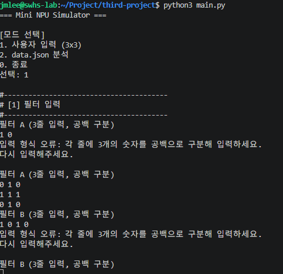
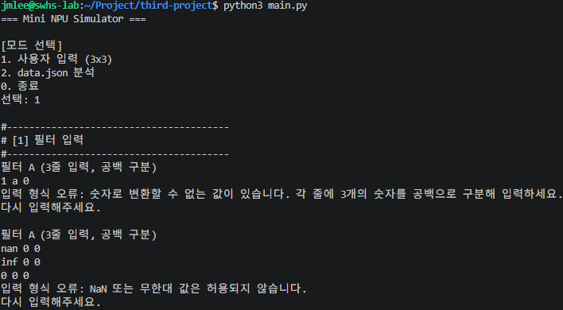

# Mini NPU 시뮬레이터: 암기 카드와 7대 필수 테스트 체크리스트

> 대상: 구현 전후에 핵심 규칙을 빠르게 복습하고, 제출 전에 필수 동작을 직접 확인하려는 학습자
>
> 기준: [docs/reference.md](../reference.md), [docs/TODO.md](../TODO.md), [main.py](../../main.py)
>
> 실행 기준: 이 작업공간에서는 <code>python3 main.py</code>를 사용한다.

---

## 사용 방법

1. 먼저 **1부 암기 카드**를 소리 내어 설명할 수 있는지 확인합니다.
2. **2부의 7대 테스트**를 위에서 아래 순서대로 실행합니다.
3. 각 테스트의 기대 결과가 실제 출력과 일치하면 체크박스를 표시합니다.
4. 마지막으로 자동 회귀 테스트를 실행하고, 결과 기록 표를 채웁니다.

> [!IMPORTANT]
> 성능 시간(ms)은 CPU 부하와 실행 시점에 따라 달라집니다. 성능 테스트에서는 정확한 소수점 값이 아니라 크기 행, 반복 횟수, 단위, N² 열의 존재를 확인합니다.

---

## 1. 반드시 외워야 하는 핵심 규칙 6가지

| 번호 | 구분 | 한 문장 암기 | 공식 또는 규칙 |
|---:|---|---|---|
| 1 | MAC | 같은 위치끼리 곱한 값을 모두 더해 유사도 점수를 만든다. | Score = Σ Pattern[r][c] × Filter[r][c] |
| 2 | 기준 벤치마크 | 십자가 A, X B, X 패턴은 B가 더 높은 점수를 얻는다. | A = 1.0, B = 5.0, 판정 = B |
| 3 | epsilon | 실수 점수는 ==로 비교하지 않고 절댓값 차이로 동점을 판정한다. | abs(A - B) < 1e-9 → UNDECIDED |
| 4 | 라벨 정규화 | 비교와 출력에는 Cross와 X만 사용한다. | +, cross, Cross → Cross / x, X → X |
| 5 | 시간복잡도 | n×n MAC 1회는 모든 칸을 한 번 방문한다. | MAC 1회 = N², 두 필터 분류 = 2N², 시간 = O(N²) |
| 6 | 리포트 정합성 | 모든 케이스는 PASS 또는 FAIL 중 하나다. | Total = PASS + FAIL |

### 1-1. MAC 공식

$$
\text{Score} =
\sum_{r=0}^{N-1}
\sum_{c=0}^{N-1}
\text{Pattern}[r][c] \times \text{Filter}[r][c]
$$

~~~text
입력 패턴 ── 같은 위치끼리 곱셈 ──> 곱 결과들 ── 누적합 ──> 필터 점수
                                                     │
                    Cross 점수와 X 점수 비교 ────────┘
                                                     │
                                                     ▼
                                        Cross / X / UNDECIDED
~~~

### 1-2. 3×3 기준 벤치마크

~~~text
필터 A: 십자가              필터 B: X                 패턴: X

0 1 0                     1 0 1                     1 0 1
1 1 1                     0 1 0                     0 1 0
0 1 0                     1 0 1                     1 0 1

A 점수 = 1.0
B 점수 = 5.0
판정   = B
~~~

### 1-3. epsilon 경계값

| 상황 | 예 | 결과 |
|---|---|---|
| 점수 차이가 epsilon보다 작음 | 0.9와 0.8999999999999999 | UNDECIDED |
| 점수 차이가 epsilon과 정확히 같음 | diff = 1e-9 | 동점 아님 |
| 점수 차이가 epsilon보다 큼 | Cross 5.0, X 1.0 | 더 큰 점수의 라벨 |

> [!WARNING]
> <code>abs(score_a - score_b) <= EPSILON</code>가 아닙니다. 이 프로젝트의 정책은 엄격한 <code>< EPSILON</code>입니다.

### 1-4. 빠른 암기 점검

- [ ] MAC은 위치별 곱과 누적합이라는 것을 수식으로 설명할 수 있다.
- [ ] A=1.0, B=5.0, 판정 B라는 3×3 기준 값을 기억한다.
- [ ] UNDECIDED 조건은 차이가 <code>1e-9보다 작을 때</code>임을 안다.
- [ ] +와 cross는 Cross, x와 X는 X로 바꾼다는 것을 안다.
- [ ] 성능 표의 N²는 필터 하나와의 MAC 1회 기준임을 안다.
- [ ] 총계가 PASS와 FAIL의 합과 반드시 같아야 함을 안다.

---
 python3 main.py 
=== Mini NPU Simulator ===

[모드 선택]
1. 사용자 입력 (3x3)
2. data.json 분석
0. 종료
선택: 1

#----------------------------------------
# [1] 필터 입력
#----------------------------------------
필터 A (3줄 입력, 공백 구분)
0 1 0
1 1 1
0 1 0
필터 B (3줄 입력, 공백 구분)
1 0 1
0 1 0
1 0 1

필터 A, 필터 B 저장 완료.

#----------------------------------------
# [2] 패턴 입력
#----------------------------------------
패턴 (3줄 입력, 공백 구분)
1 0 1
0 1 0
1 0 1

#----------------------------------------
# [3] MAC 결과
#----------------------------------------
A 점수: 1.0
B 점수: 5.0
연산 시간(평균/10회): 0.0042 ms
판정: B


## 2. 테스트 전 공통 준비

### 2-1. 자동 회귀 테스트

먼저 현재 코드가 기본 회귀 테스트를 통과하는지 확인합니다.

~~~bash
python3 -m unittest discover -s tests -v
~~~

기대 결과는 모든 테스트의 <code>ok</code>와 마지막 <code>OK</code>입니다. 이 테스트는 Grid 검증, MAC, 라벨, epsilon, 메뉴, 모드 1, 모드 2, 1차원 MAC을 자동으로 확인합니다.

### 2-2. 수동 테스트 원칙

- 한 테스트가 끝나면 메뉴에서 <code>0</code>을 입력해 프로그램을 종료합니다.
- data.json을 직접 삭제하거나 수정하지 않습니다. 파일 없음·깨진 JSON은 아래의 임시 파일 명령으로 검사합니다.
- 출력의 시간 값은 기록하되, 다른 실행과 마지막 소수점까지 같을 필요는 없습니다.
- Traceback 문자열이 보이면 즉시 실패로 기록하고 원인을 확인합니다.

---
```
jmlee@swhs-lab:~/Project/third-project$ python3 -m unittest discover -s tests -v
test_epsilon_policy_uses_strict_less_than (test_main.GridAndMacTests.test_epsilon_policy_uses_strict_less_than) ... ok
test_flattened_mac_matches_two_dimensional_mac (test_main.GridAndMacTests.test_flattened_mac_matches_two_dimensional_mac) ... ok
test_label_normalization_and_duplicate_filter_labels (test_main.GridAndMacTests.test_label_normalization_and_duplicate_filter_labels) ... ok
test_mac_reference_examples_and_mismatch (test_main.GridAndMacTests.test_mac_reference_examples_and_mismatch) ... ok
test_performance_repeat_and_flatten_guards (test_main.GridAndMacTests.test_performance_repeat_and_flatten_guards) ... ok
test_validate_grid_normalizes_valid_grid (test_main.GridAndMacTests.test_validate_grid_normalizes_valid_grid) ... ok
test_validate_grid_rejects_invalid_values (test_main.GridAndMacTests.test_validate_grid_rejects_invalid_values) ... ok
test_bundled_json_results_and_summary_are_consistent (test_main.JsonModeTests.test_bundled_json_results_and_summary_are_consistent) ... ok
test_case_schema_failures_are_controlled (test_main.JsonModeTests.test_case_schema_failures_are_controlled) ... ok
test_json_load_errors_and_mode_two_do_not_raise (test_main.JsonModeTests.test_json_load_errors_and_mode_two_do_not_raise) ... ok
test_mode_two_prints_expected_sections (test_main.JsonModeTests.test_mode_two_prints_expected_sections) ... ok
test_invalid_menu_choice_reprompts_without_traceback (test_main.MenuTests.test_invalid_menu_choice_reprompts_without_traceback) ... ok
test_mode_one_reference_example (test_main.ModeOneTests.test_mode_one_reference_example) ... ok
test_read_grid_retries_after_non_numeric_token (test_main.ModeOneTests.test_read_grid_retries_after_non_numeric_token) ... ok
test_read_grid_retries_the_entire_grid_after_bad_row (test_main.ModeOneTests.test_read_grid_retries_the_entire_grid_after_bad_row) ... ok

----------------------------------------------------------------------
Ran 15 tests in 0.006s

OK
```


## 3. 7대 필수 테스트 케이스

### [ ] 테스트 1 — 모드 1: 토큰 개수 오류 후 행렬 전체 재입력

**목적**: 한 줄에 숫자 2개 또는 4개가 들어왔을 때 예외 스택 없이 해당 행렬 전체 입력을 다시 받는지 확인합니다.

**실행 순서**

1. 아래 명령으로 프로그램을 시작합니다.

   ~~~bash
   python3 main.py
   ~~~

2. 메뉴에서 <code>1</code>을 선택합니다.
3. 필터 A의 첫 줄에 <code>1 0</code>을 입력합니다.
4. 오류 안내를 확인한 뒤, 필터 A 전체 3줄을 다시 입력합니다.

   ~~~text
   0 1 0
   1 1 1
   0 1 0
   ~~~

5. 필터 B와 패턴에는 정상 3×3 행렬을 입력하고, 종료합니다.

**기대 결과**

- [ ] <code>입력 형식 오류: 각 줄에 3개의 숫자를 공백으로 구분해 입력하세요.</code>가 보인다.
- [ ] <code>다시 입력해주세요.</code> 뒤에 필터 A의 3줄 입력 안내가 처음부터 다시 보인다.
- [ ] Traceback 또는 ValueError가 화면에 보이지 않는다.

**추가 확인**: 첫 줄에 <code>1 0 1 0</code>을 넣어도 같은 정책으로 동작해야 합니다.
```
jmlee@swhs-lab:~/Project/third-project$ python3 main.py 
=== Mini NPU Simulator ===

[모드 선택]
1. 사용자 입력 (3x3)
2. data.json 분석
0. 종료
선택: 1

#----------------------------------------
# [1] 필터 입력
#----------------------------------------
필터 A (3줄 입력, 공백 구분)
1 0
입력 형식 오류: 각 줄에 3개의 숫자를 공백으로 구분해 입력하세요.
다시 입력해주세요.

필터 A (3줄 입력, 공백 구분)
0 1 0
1 1 1
0 1 0
필터 B (3줄 입력, 공백 구분)
1 0 1 0
입력 형식 오류: 각 줄에 3개의 숫자를 공백으로 구분해 입력하세요.
다시 입력해주세요.

```

---

### [ ] 테스트 2 — 모드 1: 문자, NaN, Inf 입력 거부

**목적**: 숫자 파싱 실패와 유한하지 않은 실수 값을 모두 제어된 입력 오류로 처리하는지 확인합니다.

**문자 입력 테스트**

1. 메뉴에서 <code>1</code>을 선택합니다.
2. 필터 A의 첫 줄에 <code>1 a 0</code>을 입력합니다.
3. 필터 A 전체 3줄을 다시 정상 입력합니다.

**NaN/Inf 입력 테스트**

1. 새로 메뉴에서 <code>1</code>을 선택합니다.
2. 필터 A의 첫 줄에 <code>nan 0 0</code>을 입력합니다.
3. 필요하면 별도 실행에서 <code>inf 0 0</code>도 입력합니다.
4. 필터 A 전체 3줄을 다시 정상 입력합니다.

**기대 결과**

- [ ] 문자 입력에서는 <code>숫자로 변환할 수 없는 값</code>이 포함된 안내가 보인다.
- [ ] nan/inf 입력에서는 <code>NaN 또는 무한대 값은 허용되지 않습니다.</code>가 포함된 안내가 보인다.
- [ ] 두 경우 모두 행렬 전체 재입력으로 돌아가고 Traceback이 없다.
```
jmlee@swhs-lab:~/Project/third-project$ python3 main.py 
=== Mini NPU Simulator ===

[모드 선택]
1. 사용자 입력 (3x3)
2. data.json 분석
0. 종료
선택: 1

#----------------------------------------
# [1] 필터 입력
#----------------------------------------
필터 A (3줄 입력, 공백 구분)
1 a 0
입력 형식 오류: 숫자로 변환할 수 없는 값이 있습니다. 각 줄에 3개의 숫자를 공백으로 구분해 입력하세요.
다시 입력해주세요.

필터 A (3줄 입력, 공백 구분)
nan 0 0
inf 0 0
0 0 0
입력 형식 오류: NaN 또는 무한대 값은 허용되지 않습니다.
다시 입력해주세요.
```

---

### [ ] 테스트 3 — 모드 1: epsilon 동점과 판정 불가

**목적**: 화면에 동일하게 반올림되어 보이는 점수라도 epsilon 비교가 UNDECIDED를 만드는지 확인합니다.

메뉴에서 <code>1</code>을 선택한 뒤 아래 9줄을 순서대로 입력합니다.

~~~text
필터 A
0.9 0 0
0 0 0
0 0 0

필터 B
0.8999999999999999 0 0
0 0 0
0 0 0

패턴
1 0 0
0 0 0
0 0 0
~~~

두 필터는 패턴의 왼쪽 위 원소에만 영향을 주므로 점수는 각각 0.9와 0.8999999999999999입니다.

**기대 결과**

- [ ] A/B 점수가 출력된다. 표시 자릿수 때문에 둘 다 0.9000000000으로 보일 수 있다.
- [ ] <code>판정: 판정 불가 (|A-B| &lt; 1e-09, epsilon 동점 규칙)</code>가 출력된다.
- [ ] 점수를 <code>==</code>로 비교한 결과처럼 A나 B가 출력되지 않는다.

---

### [ ] 테스트 4 — 모드 2: 파일 없음과 깨진 JSON의 안전한 처리

**목적**: data.json 로드 실패가 프로그램을 비정상 종료시키지 않는지 확인합니다.

이 테스트는 실제 data.json을 건드리지 않고 임시 경로로 모드 2 함수를 호출합니다.

**파일 없음**

~~~bash
python3 - <<'PY'
import main

main.run_mode_2("/tmp/mini_npu_missing_data.json")
PY
~~~

**깨진 JSON**

~~~bash
python3 - <<'PY'
import tempfile
from pathlib import Path

import main

with tempfile.TemporaryDirectory() as temp_dir:
    path = Path(temp_dir) / "broken.json"
    path.write_text("{not-json", encoding="utf-8")
    main.run_mode_2(str(path))
PY
~~~

**기대 결과**

- [ ] 파일 없음에서는 <code>파일을 찾을 수 없습니다</code>가 포함된 안내가 보인다.
- [ ] 깨진 JSON에서는 <code>JSON 파싱 오류</code>가 포함된 안내가 보인다.
- [ ] 두 경우 모두 <code>메뉴로 돌아갑니다.</code>가 출력되고 Traceback이 없다.
```
jmlee@swhs-lab:~/Project/third-project$ python3 - <<'PY'
import main

main.run_mode_2("/tmp/mini_npu_missing_data.json")
PY

#----------------------------------------
# [1] 필터 로드
#----------------------------------------
data.json을 불러올 수 없습니다: 파일을 찾을 수 없습니다: /tmp/mini_npu_missing_data.json
메뉴로 돌아갑니다.
jmlee@swhs-lab:~/Project/third-project$ python3 - <<'PY'
import tempfile
from pathlib import Path

import main

with tempfile.TemporaryDirectory() as temp_dir:
    path = Path(temp_dir) / "broken.json"
    path.write_text("{not-json", encoding="utf-8")
    main.run_mode_2(str(path))
PY

#----------------------------------------
# [1] 필터 로드
#----------------------------------------
data.json을 불러올 수 없습니다: JSON 파싱 오류: Expecting property name enclosed in double quotes: line 1 column 2 (char 1)
메뉴로 돌아갑니다.
```
---

### [ ] 테스트 5 — 모드 2: 패턴 키의 N 해석과 size_N 필터 선택

**목적**: <code>size_5_1</code>에서 N=5를 읽고 <code>filters.size_5</code>를 선택하는지 확인합니다.

~~~bash
python3 - <<'PY'
import json

import main

with open("data.json", "r", encoding="utf-8") as file_obj:
    data = json.load(file_obj)

filters_by_size, _messages = main.build_filters_by_size(data["filters"])
result = main.analyze_case(
    "size_5_1",
    data["patterns"]["size_5_1"],
    filters_by_size,
)

print(result)
assert result["size"] == 5
assert result["status"] == "PASS"
assert result["prediction"] == "X"
PY
~~~

**기대 결과**

- [ ] 결과의 <code>size</code>가 5다.
- [ ] size_5_1은 Cross 점수 1.0, X 점수 9.0, prediction X, PASS다.
- [ ] size_5가 아닌 다른 필터로 계산되지 않는다.
```
jmlee@swhs-lab:~/Project/third-project$ python3 - <<'PY'
import json

import main

with open("data.json", "r", encoding="utf-8") as file_obj:
    data = json.load(file_obj)

filters_by_size, _messages = main.build_filters_by_size(data["filters"])
result = main.analyze_case(
    "size_5_1",
    data["patterns"]["size_5_1"],
    filters_by_size,
)

print(result)
assert result["size"] == 5
assert result["status"] == "PASS"
assert result["prediction"] == "X"
PY
{'case_id': 'size_5_1', 'status': 'PASS', 'reason_code': None, 'reason_message': None, 'expected': 'X', 'prediction': 'X', 'score_cross': 1.0, 'score_x': 9.0, 'size': 5}
```
---

### [ ] 테스트 6 — 모드 2: 스키마/크기/라벨 오류는 케이스별 FAIL 후 계속 진행

**목적**: 한 케이스가 잘못돼도 다음 케이스 분석, 총계, 실패 사유 출력이 계속되는지 확인합니다.

**번들 data.json의 크기 불일치**

~~~bash
python3 main.py <<'EOF'
2
0
EOF
~~~

출력에서 <code>size_13_3</code>은 13×13이라는 키와 10×10 input이 달라 <code>SIZE_MISMATCH</code> FAIL이 됩니다. 그 뒤의 <code>size_25_1</code>, <code>size_25_2</code>도 계속 출력되는지 확인합니다.

**라벨 오류를 파일 변경 없이 검사**

~~~bash
python3 - <<'PY'
import json

import main

with open("data.json", "r", encoding="utf-8") as file_obj:
    data = json.load(file_obj)

filters_by_size, _messages = main.build_filters_by_size(data["filters"])
result = main.analyze_case(
    "size_5_bad_label",
    {
        "input": [[0.0] * 5 for _ in range(5)],
        "expected": "circle",
    },
    filters_by_size,
)

print(result)
assert result["status"] == "FAIL"
assert result["reason_code"] == "EXPECTED_LABEL_INVALID"
PY
~~~
```
== Mini NPU Simulator ===

[모드 선택]
1. 사용자 입력 (3x3)
2. data.json 분석
0. 종료
선택: 
#----------------------------------------
# [1] 필터 로드
#----------------------------------------
✓ size_5 필터 로드 완료 (Cross, X)
✓ size_13 필터 로드 완료 (Cross, X)
✓ size_25 필터 로드 완료 (Cross, X)

#----------------------------------------
# [2] 패턴 분석 (라벨 정규화 적용)
#----------------------------------------
--- size_5_1 ---
Cross 점수: 1.0
X 점수: 9.0
판정: X | expected: X | PASS
--- size_5_2 ---
Cross 점수: 9.0
X 점수: 1.0
판정: Cross | expected: Cross | PASS
--- size_13_1 ---
Cross 점수: 0.0
X 점수: 0.0
판정: UNDECIDED | expected: X | FAIL
  사유: 동점(|Cross-X| < 1e-09) 규칙에 따라 FAIL
--- size_13_2 ---
Cross 점수: 25.0
X 점수: 1.0
판정: Cross | expected: Cross | PASS
--- size_13_3 ---
판정 불가(스키마 오류): 키에서 읽은 크기 13와 패턴 행렬 크기 10가 다릅니다. [SIZE_MISMATCH]
--- size_25_1 ---
Cross 점수: 1.0
X 점수: 49.0
판정: X | expected: X | PASS
--- size_25_2 ---
Cross 점수: 49.0
X 점수: 1.0
판정: Cross | expected: Cross | PASS

#----------------------------------------
# [3] 성능 분석 (평균/10회)
#----------------------------------------
크기                 평균 시간(ms)         연산 횟수
------------------------------------------
3×3                   0.0011             9
5×5                   0.0019            25
13×13                 0.0074           169
25×25                 0.0235           625

#----------------------------------------
# [4] 결과 요약
#----------------------------------------
총 테스트: 7개
통과: 5개
실패: 2개

실패 케이스:
- size_13_1: 동점(|Cross-X| < 1e-09) 규칙에 따라 FAIL
- size_13_3: 키에서 읽은 크기 13와 패턴 행렬 크기 10가 다릅니다.
```
```
jmlee@swhs-lab:~/Project/third-project$ python3 - <<'PY'
import json

import main

with open("data.json", "r", encoding="utf-8") as file_obj:
    data = json.load(file_obj)

filters_by_size, _messages = main.build_filters_by_size(data["filters"])
result = main.analyze_case(
    "size_5_bad_label",
    {
        "input": [[0.0] * 5 for _ in range(5)],
        "expected": "circle",
    },
    filters_by_size,
)

print(result)
assert result["status"] == "FAIL"
assert result["reason_code"] == "EXPECTED_LABEL_INVALID"
PY
{'case_id': 'size_5_bad_label', 'status': 'FAIL', 'reason_code': 'EXPECTED_LABEL_INVALID', 'reason_message': "expected 값 'circle'을 Cross/X로 정규화할 수 없습니다.", 'expected': None, 'prediction': None, 'score_cross': None, 'score_x': None, 'size': 5}
```
**기대 결과**

- [ ] size_13_3은 MAC을 시도하지 않고 SIZE_MISMATCH로 FAIL 처리된다.
- [ ] size_25_1과 size_25_2는 size_13_3 이후에도 분석되어 PASS가 출력된다.
- [ ] circle expected는 EXPECTED_LABEL_INVALID FAIL이 된다.
- [ ] 번들 data.json의 요약은 총 7개, 통과 5개, 실패 2개다.
- [ ] 총계 식 <code>7 = 5 + 2</code>가 성립한다.

---

### [ ] 테스트 7 — 성능 분석 표와 N² 열 출력

**목적**: 성능 측정이 모드별 필수 크기와 표 헤더를 모두 출력하는지 확인합니다.

**모드 1**

테스트 1 또는 기준 벤치마크 입력을 끝까지 완료합니다.

**기대 결과**

- [ ] <code>연산 시간(평균/10회): ... ms</code>가 출력된다.
- [ ] 모드 1은 3×3 입력을 기준으로 한 성능 시간을 출력한다.

**모드 2**

~~~bash
python3 main.py <<'EOF'
2
0
EOF
~~~

**기대 결과**

- [ ] <code>크기</code>, <code>평균 시간(ms)</code>, <code>연산 횟수</code> 표 헤더가 보인다.
- [ ] 3×3 / 5×5 / 13×13 / 25×25 행이 모두 보인다.
- [ ] 각각의 연산 횟수가 9 / 25 / 169 / 625로 출력된다.
- [ ] 시간 값은 ms 단위이며, I/O 시간을 포함한 전체 프로그램 시간이 아니다.
```
jmlee@swhs-lab:~/Project/third-project$ python3 main.py <<'EOF'
2
0
EOF
=== Mini NPU Simulator ===

[모드 선택]
1. 사용자 입력 (3x3)
2. data.json 분석
0. 종료
선택: 
#----------------------------------------
# [1] 필터 로드
#----------------------------------------
✓ size_5 필터 로드 완료 (Cross, X)
✓ size_13 필터 로드 완료 (Cross, X)
✓ size_25 필터 로드 완료 (Cross, X)

#----------------------------------------
# [2] 패턴 분석 (라벨 정규화 적용)
#----------------------------------------
--- size_5_1 ---
Cross 점수: 1.0
X 점수: 9.0
판정: X | expected: X | PASS
--- size_5_2 ---
Cross 점수: 9.0
X 점수: 1.0
판정: Cross | expected: Cross | PASS
--- size_13_1 ---
Cross 점수: 0.0
X 점수: 0.0
판정: UNDECIDED | expected: X | FAIL
  사유: 동점(|Cross-X| < 1e-09) 규칙에 따라 FAIL
--- size_13_2 ---
Cross 점수: 25.0
X 점수: 1.0
판정: Cross | expected: Cross | PASS
--- size_13_3 ---
판정 불가(스키마 오류): 키에서 읽은 크기 13와 패턴 행렬 크기 10가 다릅니다. [SIZE_MISMATCH]
--- size_25_1 ---
Cross 점수: 1.0
X 점수: 49.0
판정: X | expected: X | PASS
--- size_25_2 ---
Cross 점수: 49.0
X 점수: 1.0
판정: Cross | expected: Cross | PASS

#----------------------------------------
# [3] 성능 분석 (평균/10회)
#----------------------------------------
크기                 평균 시간(ms)         연산 횟수
------------------------------------------
3×3                   0.0011             9
5×5                   0.0019            25
13×13                 0.0077           169
25×25                 0.0241           625

#----------------------------------------
# [4] 결과 요약
#----------------------------------------
총 테스트: 7개
통과: 5개
실패: 2개

실패 케이스:
- size_13_1: 동점(|Cross-X| < 1e-09) 규칙에 따라 FAIL
- size_13_3: 키에서 읽은 크기 13와 패턴 행렬 크기 10가 다릅니다.
```
---

## 4. 결과 기록 표

수동 테스트를 실행한 뒤 아래 표를 채웁니다.

| 테스트 | 날짜 | PASS / FAIL | 핵심 증거 또는 출력 | 메모 |
|---|---|---|---|---|
| 1. 토큰 개수 오류 |  |  |  |  |
| 2. 문자/NaN/Inf |  |  |  |  |
| 3. epsilon 동점 |  |  |  |  |
| 4. 파일 없음/깨진 JSON |  |  |  |  |
| 5. size_N 필터 선택 |  |  |  |  |
| 6. 스키마 FAIL 지속 처리 |  |  |  |  |
| 7. 성능 표 |  |  |  |  |
| 자동 회귀 테스트 |  |  |  |  |

## 5. 제출 전 한 줄 점검

아래 문장을 모두 자신 있게 말할 수 있으면 핵심 구현과 테스트의 연결을 이해한 것입니다.

> “MAC은 N²개의 위치별 곱을 더한다. 나는 입력을 검증한 뒤 Cross/X로 라벨을 표준화하고, abs 점수 차이가 1e-9보다 작으면 UNDECIDED로 처리한다. JSON의 한 케이스가 실패해도 Total = PASS + FAIL을 유지하며 다음 케이스를 계속 분석한다.”

